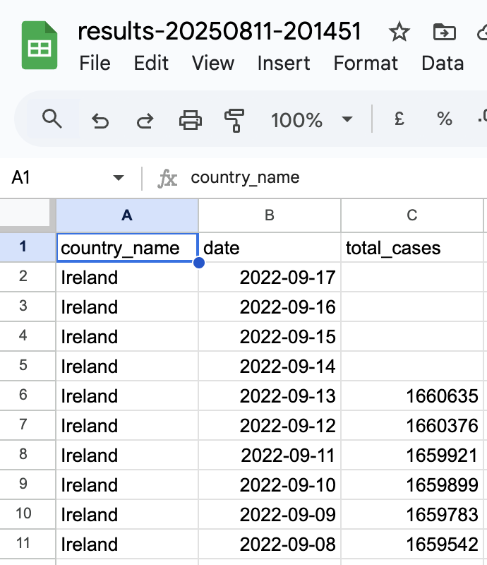

# 1_bigquery_setup
My first BigQuery public dataset project — querying COVID-19 data for Ireland
# BigQuery Setup Project

This is my first step towards becoming an Analytics Engineer.

## Dataset
**Source:** `bigquery-public-data.covid19_open_data_eu.covid19_open_data`

## SQL Query
```sql
SELECT
  country_name,
  date,
  SUM(cumulative_confirmed) AS total_cases
FROM
  `bigquery-public-data.covid19_open_data_eu.covid19_open_data`
WHERE
  country_name = 'Ireland'
GROUP BY
  country_name,
  date
ORDER BY
  date DESC
LIMIT 10;

What I Learned
	•	How to access and query public datasets in BigQuery
	•	How to fully qualify table names across projects


